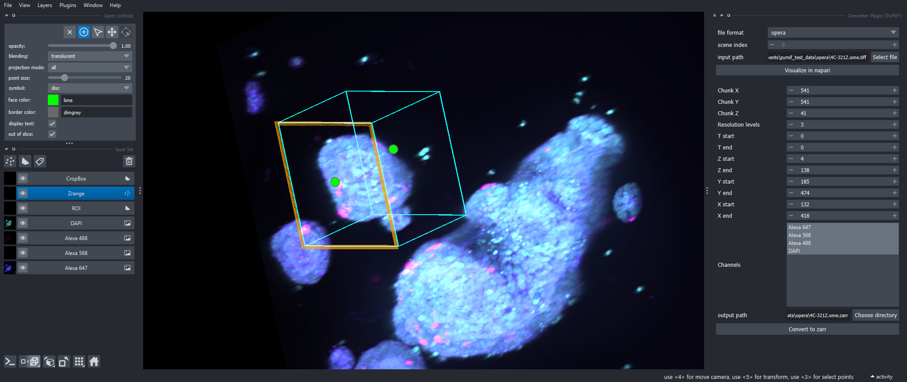

# PyMIF — Python code for users of the Mesoscopic Imaging Facility

**PyMIF** is a modular Python package to read, visualize, and write multiscale (pyramidal) microscopy image data from a variety of microscope platforms available at the [Mesoscopic Imaging Facility (MIF)](https://www.embl.org/groups/mesoscopic-imaging-facility/) into the [OME-NGFF (Zarr)](https://ngff.openmicroscopy.org/) format.

For more information, see [the documentation page](https://grinic.github.io/pymif/).

> [!NOTE]
> As of v0.3.0, PyMIF follows NGFF v0.5 standards. Datasets created with older version of PyMIF (e.g. 0.2.4) can still be loaded using the manager `ZarrV04Manager` as shown in [examples](https://github.com/grinic/pymif/tree/main/examples).


*Demonstration of pymif usage. Data: near newborn mouse embryo (~1.5 cm long). Fluorescence signal: methylene blue + autofluorescence. Sample processed and imaged by Montserrat Coll at the Mesoscopic Imaging Facility. Video speed: 2.5X real speed.*

---

## 🚀 Getting Started

### 📥 Installation

It is recommended to install [miniforge3](https://github.com/conda-forge/miniforge) as Python distribution and install PyMIF in a clean conda environment:

```console
$ conda create -n pymif python=3.12
$ conda activate pymif
```

Installation is then done by cloning the repository:

```console
$ git clone https://github.com/grinic/pymif.git
$ cd pymif
$ pip install .
```

**NOTE**: Use the `-e` (editable) option if you want to use the download as installation folder.

### 📚 Minimal Example Usage

**Python script:**

```python
import pymif.microscope_manager as mm

dataset = mm.ViventisManager("path/to/Position_1")
dataset.build_pyramid(num_levels=3)
dataset.to_zarr("output.zarr")
dataset_zarr = mm.ZarrManager("output.zarr")
viewer = dataset_zarr.visualize(start_level=0, in_memory=False)
```

**CLI:**

```console
$ conda activate pymif
$ pymif 2zarr -i INPUT_FILE -m MICROSCOPE -z ZARR_OUTPUT
```

For more examples, see [examples](https://github.com/grinic/pymif/tree/main/examples).

**Napari plugin:**

A napari PyMIF plugin exists (`Pugins > PyMIF > Converter Plugin`) that allows to load data and visualize them in the viewer.

Optionally, the user can define 3D ROIs, select timepoints and channels, and number of resolution layers in the pyramid, before converting the dataset into ome-zarr:


