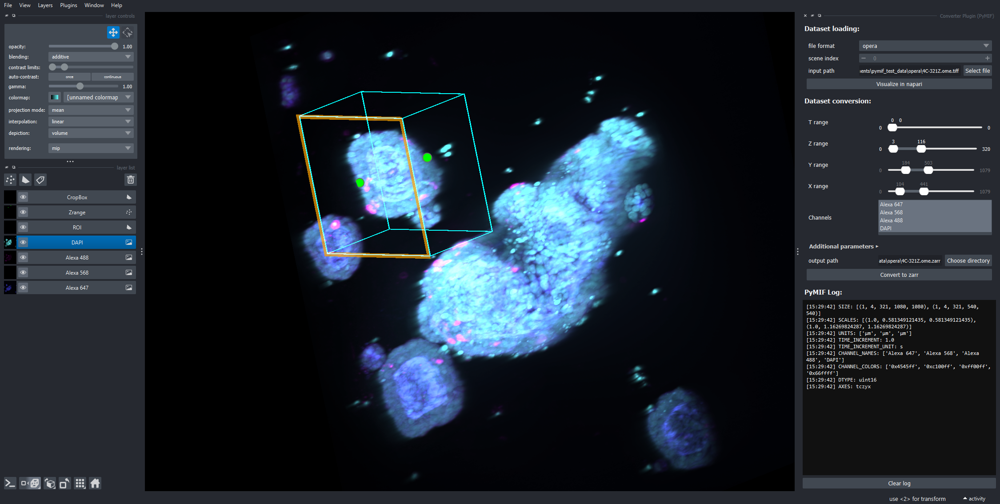

# PyMIF — microscopy I/O, OME-Zarr conversion, and NGFF utilities


[](LICENSE)
[](https://github.com/grinic/pymif/actions/workflows/tests.yml)
[](https://codecov.io/gh/grinic/pymif)
[](https://github.com/grinic/pymif/actions/workflows/documentation.yml)
[](https://github.com/grinic/pymif/actions/workflows/docker-publish.yml)
[](https://github.com/grinic/pymif/releases)
[](https://github.com/grinic/pymif/stargazers)

**PyMIF** is a Python package for reading microscopy datasets from multiple acquisition systems, building multiscale pyramids, writing **OME-NGFF / OME-Zarr**, and interacting with those datasets from Python, the command line, and napari.

It is developed for users of the [Mesoscopic Imaging Facility (MIF)](https://www.embl.org/groups/mesoscopic-imaging-facility/), but the repository now covers a broader scope than simple vendor import: it includes a reusable manager API, NGFF-aware zarr creation utilities, region writing for images and labels, batch conversion helpers, and napari widgets for conversion and overview generation.

For the rendered docs, see [the documentation page](https://grinic.github.io/pymif/).

> [!NOTE]
> Current PyMIF releases write **NGFF v0.5 / Zarr v3** by default. Existing **NGFF v0.4 / Zarr v2** datasets remain supported through `ZarrManager` and `ZarrV04Manager`.


*Demonstration of PyMIF usage. Data: near newborn mouse embryo (~1.5 cm long). Fluorescence signal: methylene blue + autofluorescence. Sample processed and imaged by Montserrat Coll at the Mesoscopic Imaging Facility. Video speed: 2.5× real speed.*

---

## Current repository scope

PyMIF currently contains five main pieces:

1. **Microscope managers** for reading datasets and normalizing them to a common API.
2. **OME-Zarr / NGFF writing utilities** for full dataset export, empty dataset creation, subgroup creation, and region updates.
3. **Pyramid and subsetting helpers** for multiscale generation and dataset cropping.
4. **CLI tools** for one-off and batch conversion to zarr.
5. **Napari widgets** for interactive conversion, ROI selection, and overview generation.

### Supported data sources

The main reader classes currently exposed by `pymif.microscope_manager` are:

- `ArrayManager` — wrap an in-memory NumPy or Dask array using PyMIF metadata conventions.
- `LuxendoManager` — Luxendo XML + HDF5 datasets.
- `OperaManager` — Opera Phenix / Opera PE OME-TIFF style datasets.
- `ScapeManager` — Leica SCAPE OME-TIFF + XLIF datasets.
- `ViventisManager` — Viventis LS1 datasets.
- `ZeissManager` — Zeiss CZI datasets.
- `ZarrManager` — NGFF v0.4/v0.5 OME-Zarr datasets.
- `ZarrV04Manager` — compatibility reader for older v0.4-style datasets.

### Core capabilities

- Read vendor-specific microscopy metadata into a shared metadata schema.
- Represent image data lazily with Dask.
- Build multiscale pyramids from a base-resolution dataset.
- Write OME-Zarr in **NGFF v0.4/Zarr v2** or **NGFF v0.5/Zarr v3** form.
- Create empty image groups and label groups inside an existing zarr hierarchy.
- Write image patches or label patches back into an existing zarr dataset.
- Visualize datasets in napari.
- Convert single datasets or CSV-defined batches from the CLI.

---

## Installation

A clean conda environment is recommended:

```console
conda create -n pymif python=3.12
conda activate pymif
```

Then install from the repository:

```console
git clone https://github.com/grinic/pymif.git
cd pymif
pip install .
```

For development work:

```console
pip install -e .
```

To use the napari widgets as well:

```console
pip install -e .[napari]
```

### Versioning

PyMIF uses semantic versions (`MAJOR.MINOR.PATCH`) derived from git tags with [setuptools-scm](https://setuptools-scm.readthedocs.io/). The version is never edited by hand. Releases are **opt-in**: merging a PR into `main` does nothing unless the PR carries a release label, so you can merge many feature PRs and release once, from the PR that should trigger it:

| PR label | Result |
|---|---|
| `release:major` | new `vX.0.0` tag, GitHub Release and Docker image |
| `release:minor` | new `vX.Y.0` tag, GitHub Release and Docker image |
| `release:patch` | new `vX.Y.Z` tag, GitHub Release and Docker image |
| none | no release |

The label must be on the PR when it is merged (create the three labels once in the repository's Labels page). The generated release notes cover everything merged since the previous release.

Direct pushes to `main` do not create a release; a Docker image can also be built by hand by pushing a `v*` tag or running the Docker workflow manually. Installs from untagged commits get a dev version such as `0.3.2.dev3+g1a2b3c4`. Check the installed version with `pymif --version` or `pymif.__version__`.

---

## Quick usage

### Python API

```python
import pymif.microscope_manager as mm

# Read a source dataset
source = mm.ViventisManager("path/to/Position_1")

# Build a pyramid in memory
source.build_pyramid(num_levels=3)

# Export to OME-Zarr (default: NGFF v0.5 / zarr v3)
source.to_zarr("output.zarr")

# Re-open the written zarr dataset
z = mm.ZarrManager("output.zarr")
viewer = z.visualize(start_level=0, in_memory=False)
```

### Create an empty zarr dataset from metadata

```python
import pymif.microscope_manager as mm

z = mm.ZarrManager(
    "empty.zarr",
    mode="a",
    metadata={
        "size": [(1, 2, 16, 256, 256)],
        "chunksize": [(1, 1, 16, 128, 128)],
        "scales": [(2.0, 0.5, 0.5)],
        "units": ("micrometer", "micrometer", "micrometer"),
        "axes": "tczyx",
        "channel_names": ["GFP", "RFP"],
        "channel_colors": ["00FF00", "FF0000"],
        "time_increment": 1.0,
        "time_increment_unit": "second",
        "dtype": "uint16",
    },
)
```

### Axis-aware ZarrManager metadata

Most microscope-specific managers still normalize data to legacy `tczyx`, but `ZarrManager` and `ArrayManager` can now write and read any unique subset of the image axes `t`, `c`, `z`, `y`, and `x`. 

> [!NOTE]
> The axes string must have one label per array dimension and may not contain non-image axes such as tiles, ROIs, scenes, or wells.

For example, a two-dimensional YX intensity image can be written as:

```python
import dask.array as da
import numpy as np
import pymif.microscope_manager as mm

img = np.zeros((512, 512), dtype=np.uint16)
levels = [da.from_array(img, chunks=(256, 256))]
metadata = {
    "axes": "yx",
    "size": [(512, 512)],
    "chunksize": [(256, 256)],
    "scales": [(0.5, 0.5)],       # follows the spatial axes in axes order
    "units": ("micrometer", "micrometer"),
    "dtype": "uint16",
    "data_type": "intensity",    # or "label"
}

mm.ArrayManager(levels, metadata).to_zarr("yx_image.zarr")
```

Use `data_type="label"` for segmentation, mask, or annotation data. Label arrays must use an integer dtype. For NGFF v0.5/Zarr v3, PyMIF stores the semantic type under `attrs["ome"]["data_type"]`, writes array-level `dimension_names`, writes `multiscales[0]["type"] = "label"`, and adds `image-label` metadata. For NGFF v0.4/Zarr v2, the equivalent metadata is stored directly on the group attributes.

Legacy calls that create labels from an intensity image metadata dictionary still work:

```python
z = mm.ZarrManager("image.zarr", mode="a")
z.create_empty_group("nuclei", image_metadata, is_label=True)
```

When `image_metadata["axes"] == "tczyx"`, this legacy `is_label=True` form creates a `tzyx` label group by dropping the intensity channel axis. New callers that really want channelled label data can pass explicit label metadata instead:

```python
label_metadata = {**image_metadata, "data_type": "label"}
z.create_empty_group("classes", label_metadata, data_type="label")
```

### Update a region in an existing zarr image

```python
import numpy as np
import pymif.microscope_manager as mm

z = mm.ZarrManager("output.zarr", mode="a")
patch = np.full((1, 1, 2, 64, 64), 999, dtype=np.uint16)

z.write_image_region(
    patch,
    t=slice(0, 1),
    c=slice(0, 1),
    z=slice(10, 12),
    y=slice(100, 164),
    x=slice(100, 164),
    level=0,
)
```

---

## CLI

Single conversion:

```console
pymif 2zarr -i INPUT_PATH -m MICROSCOPE -z OUTPUT_ZARR
```

Batch conversion from a CSV manifest:

```console
pymif batch2zarr -i INPUT_FILE.csv
```

Get help:

```console
pymif -h
pymif 2zarr -h
pymif batch2zarr -h
```

---

## Napari plugin

PyMIF provides napari widgets for conversion and overview generation. After installing the napari extras, the conversion widget is available from:

`Plugins > PyMIF > Converter Plugin`

The widget can load data, preview channels, define a 3D ROI, restrict z/time/channel ranges, choose pyramid settings, and export to OME-Zarr. For axis-aware zarr datasets, controls tied to missing axes are disabled; for example, a dataset with `axes="yx"` has no active T slider or channel selector.



---

## Advanced

These options control how the OME-Zarr output is laid out and how fast it is written. They are available in the Python API (`to_zarr(...)` keyword arguments), the CLI (flags and batch CSV columns) and the napari converter (the *Additional parameters* panel).

| Python / CSV column | CLI flag | napari control | Default |
|---|---|---|---|
| `shards` | `-sh`, `--shards` | Sharding (zarr v3 only) | `auto` |
| `shard_target_mb` | `-stm`, `--shard_target_mb` | Shard target (MB) | 1024 |
| `shard_exclude_axes` | `-sea`, `--shard_exclude_axes` | Never merge axes | `t c` |
| `drop_singleton` | `-ds`, `--drop_singleton` | Drop singleton axes | `true` |
| `num_workers` | `-nw`, `--num_workers` | Write threads (0 = auto) | auto |

In the batch CSV, leave a cell empty to use the default (so an empty `shards` cell means `auto`; write `none` to disable sharding).

### Sharding (zarr v3 only)

Sharding is on by default (`shards="auto"`). Without it every chunk is its own file; with sharding, many chunks are packed into one larger file (a *shard*), which greatly reduces the number of files on disk while each chunk stays individually readable. Sharding needs zarr v3 / NGFF 0.5: with zarr v2 PyMIF issues a warning and sets sharding to none.

```python
# Let PyMIF choose shard sizes (about shard_target_mb of uncompressed data per shard)
dataset.to_zarr("out.zarr", shards="auto", shard_target_mb=256)

# Disable sharding: one file per chunk
dataset.to_zarr("out.zarr", shards=None)

# Or give an explicit shard shape (one value per axis); it is snapped to a
# multiple of the chunk shape and clipped to each level's extent
dataset.to_zarr("out.zarr", shards=(1, 1, 8, 2160, 4096))
```

```console
pymif 2zarr -i INPUT -m opera -z OUT.zarr -sh auto -stm 256 -sea t c   # or: -sh none to disable
```

- `shards="auto"` picks a shard shape per pyramid level and leaves small levels unsharded.
- `shard_exclude_axes` lists axes that `"auto"` never merges chunks along. It defaults to `t c`, so each timepoint and channel stays in its own shard. Use `none` (CLI/CSV) or `()` (Python) to allow every axis to merge. An explicit shard shape is always used exactly as given.
- `shard_target_mb` is the target uncompressed size of a shard. The default is 1024 MB (1 GB). Larger shards mean fewer files but more memory per write thread (see below).

### Singleton axes

With `drop_singleton=True` (the default) any `t`, `c` or `z` axis of size 1 is removed from the written dataset, so a single-timepoint, single-channel stack is stored as a plain `zyx` array. The axes list, scales, units and any `chunks`/`shards` you gave for the full axis set are adjusted accordingly. `y` and `x` are never dropped. Pass `drop_singleton=False` (`-ds false` in the CLI, `false` in the CSV, or untick the napari checkbox) to keep every axis.

```python
dataset.to_zarr("out.zarr", drop_singleton=False)   # keep size-1 t/c/z axes
```

Note that, because this is on by default, existing code that writes datasets with size-1 `t`, `c` or `z` axes now produces arrays with fewer dimensions.

### Parallel writing

Blocks of the dataset are compressed and written by several threads at once. `num_workers` sets the thread count; by default PyMIF uses **half of the available cores, capped at 8**, because writing stops getting faster beyond roughly 8 threads while memory use keeps growing.

```python
dataset.to_zarr("out.zarr", num_workers=4)
```

```console
pymif 2zarr -i INPUT -m opera -z OUT.zarr -nw 4
```

How it works:

- **Sharded levels** are written one whole shard per task, so threads never touch the same file and no locking is needed. Each thread holds one shard in memory, so the thread count is automatically reduced to fit in about half of the free RAM, and a warning is shown if that limits parallelism. If it does, use smaller shards (a lower `shard_target_mb`).
- **All pyramid levels are written in a single pass**, so the source data is read once instead of once per level. This matters most for slow sources such as files on a network drive.
- With `compute=False`, `to_zarr` returns the unevaluated dask tasks instead of writing, and `num_workers` does not apply: you run them with your own scheduler.

Writing speed is also bounded by how fast the source can be read and decoded, which `num_workers` does not change.

---

## Documentation strategy in this repository

PyMIF uses **Sphinx + MyST + AutoAPI**. In practice this means:

- user-facing project scope belongs in `README.md` and `doc/README.md`
- API pages are generated automatically from Python docstrings
- documenting classes, methods, and helper functions directly in the source code is the best way to improve the docs

The most important API entry points to document and keep stable are:

- `MicroscopeManager`
- vendor reader classes in `pymif.microscope_manager`
- `ZarrManager`
- zarr-writing helpers in `pymif.microscope_manager.utils`
- CLI entry points in `pymif.cli`
- napari widgets in `pymif.napari`

---

## Contributing and extending PyMIF

New microscope support is typically added by subclassing `MicroscopeManager` and implementing `read()` so that it returns:

```python
Tuple[List[dask.array.Array], Dict[str, Any]]
```

The returned metadata should follow the PyMIF schema used across the repository, including:

```python
{
  "size": [... per pyramid level ...],
  "chunksize": [... per pyramid level ...],
  "scales": [... per pyramid level ...],
  "units": (...),
  "axes": "tczyx",
  "channel_names": [...],
  "channel_colors": [...],
  "time_increment": ...,
  "time_increment_unit": ...,
  "dtype": ...,
}
```

Once that contract is respected, the new manager automatically benefits from the common PyMIF tooling such as `build_pyramid()`, `to_zarr()`, `visualize()`, `reorder_channels()`, `update_metadata()`, and `subset_dataset()`.
